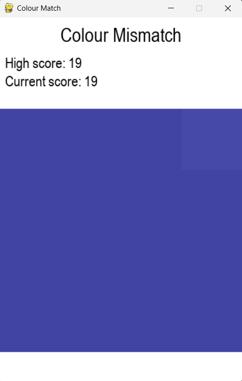
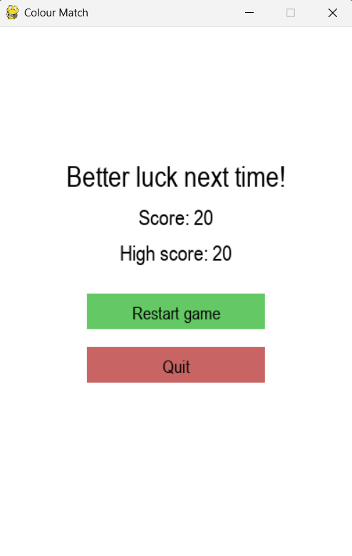

# Colour Mismatch Game

This is a simple visual game made with Python and `pygame`. A grid of squares appears on the screen — all of them the same color... except one. Your job? Find the odd one out and click on it.

---

## How to Play

- A 4 x 4 grid appears with one square slightly different in color.
- Click on the odd square.

---

## Requirements

- Python 3.x
- `pygame` library

Install `pygame` using pip:

```bash
pip install pygame
```

## Screenshots

| Game Screen | Lose Screen |
|-----------|-----------|
|  |  |
